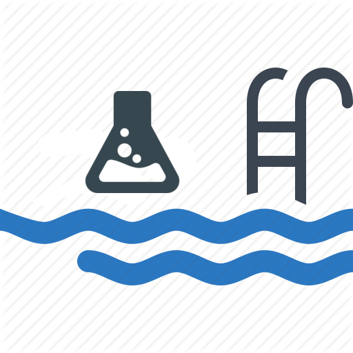

<p align="center">
  
</p>

<h1 align="center">AquachemD</h1>
<p align="center"><b>Open-source, automated pool water chemistry — pH, ORP, and dosing, done right.</b></p>

---

Pool chemistry controllers from the major manufacturers are closed, expensive, and locked to their own ecosystem. **AquachemD** is the alternative: a lightweight Linux daemon that runs on a Raspberry Pi, reads real pH/ORP/temperature/pressure sensors, drives your dosing pumps with the same logic a commercial controller uses, and hands everything over to MQTT so it plugs straight into Home Assistant, Apple HomeKit, or any automation stack you already run.

No subscriptions. No cloud dependency. No proprietary sensor lock-in. Just an open daemon, a config file, and full visibility into exactly what your pool chemistry is doing and why.

## Why AquachemD

- **You own the data and the logic.** Everything runs locally on your own hardware. No cloud account, no vendor API, nothing to stop working if a company goes out of business.
- **It talks to what you already have.** MQTT with Home Assistant auto-discovery out of the box, a built-in web dashboard, and — if you're running [AqualinkD](https://github.com/aqualinkd/aqualinkd) for pool automation — dosing that's automatically synchronized with your filter pump schedule.
- **It's built for real pool hardware**, not a hobbyist proof of concept: industrial Atlas Scientific EZO sensor circuits, GPIO-driven relay pumps, and hardware/software safety interlocks that stop dosing the moment something looks wrong.
- **It's honest about safety.** Dosing acid and chlorine into water that isn't flowing is a genuine hazard — not just an inconvenience. AquachemD is built around interlocks first, dosing logic second.

## What it actually does

### Reads your water chemistry
- **pH and ORP** via Atlas Scientific EZO circuits over I2C — the same industrial-grade sensors used in commercial pool controllers.
- **Temperature** via an EZO probe, a DS18B20 One-Wire sensor, or pulled in from an external MQTT source (e.g. your filter pump's built-in sensor).
- **Filter pressure** via an I2C pressure sensor, useful for catching a clogging filter before it becomes a flow problem.
- **Any other Linux sysfs value** through a generic, regex-based sensor reader — if it shows up as a file under `/sys`, AquachemD can read it and publish it.
- Optional **temperature-compensated pH readings**, since a probe's raw millivolt output drifts with water temperature.

Sensors can also be told to simply stop trusting their own readings when conditions aren't right. Each sensor can be scoped to a safety interlock (the same flow-cell-full / pump-running condition that gates dosing), so a pH or ORP probe sitting in stagnant or drained water doesn't feed a bogus reading into your dashboard or dosing logic. Sensors that don't depend on flow — filter pressure, or a value pulled in from an external MQTT source — can be exempted from that gating and keep reporting regardless.

### Doses automatically, and tells you exactly why
AquachemD uses a **threshold table**, not a black box: you define pH/ORP ranges and how long to run the pump for each one (e.g. "if pH is 8.0 or above, dose for 20 seconds"), and the daemon works out which bracket the current reading falls into. Two additional refinements that go beyond a simple lookup table:
- **Average-dose calculation** — smooths dosing decisions using a rolling average instead of reacting to a single noisy reading.
- **Per-channel maximum dose time** — a hard ceiling on how long any single dose can run, independent of what the threshold table says, so a bad sensor reading can never trigger a runaway dose.

A separate **water-topup doser** (`h2o`) is supported alongside pH and ORP dosing, for automated fill in response to level sensors.

**Dosing checks run on a full cron schedule** — not a fixed interval — so you have complete control over cadence. Check and dose every 30 minutes through summer, drop to every 2 hours over winter, or run a different schedule on weekends; it's standard cron syntax (minute/hour/day/month/weekday), editable straight from the web UI.

Each dosing channel can also independently choose whether to react to the **live sensor reading or a rolling average**, on a user-defined reset period. This matters because pH and ORP don't behave the same way: pH is comparatively stable, so dosing off the live reading gives the fastest correction, while ORP can swing significantly over the course of a day — dosing straight off a live ORP spike risks over-correcting, so averaging it over a period (e.g. hourly or daily) gives a steadier basis for the dose calculation. Both channels support either mode; which one suits your pool is your call.

As a backstop against a sensor going haywire, each doser also has a **user-set maximum total volume per period** (e.g. 500 mL a day). If that cap is hit, AquachemD logs a warning and simply skips further dosing on that channel until the period resets — it doesn't disable the doser or require you to intervene, since the cap is there to survive a temporarily bad reading, not to demand a manual reset every time it's touched.

### Won't dose unless it's actually safe to
This is the part that matters most. Dosing is gated behind **interlock conditions** that must *all* be satisfied before a pump is allowed to run:
- **MQTT interlocks** — e.g. only dose if AqualinkD reports the filter pump is running. This is how AquachemD and AqualinkD stay in sync without any direct wiring between them.
- **GPIO interlocks** — physical flow switches or tank-level sensors wired directly to the Pi, with a configurable delay before a condition is considered "met" (avoiding false triggers from momentary flow blips).

The result: chemicals are never dispensed into stagnant water, which is exactly the scenario that risks dangerous gas buildup from mixing chlorine and acid.

Interlocks aren't limited to "is the filter pump on" — any equipment state you can get onto MQTT can gate a doser. A common example: if your acid injection point sits physically upstream of a pressure-side pool cleaner, dosing while that cleaner's booster pump is running can alter flow through the injection point in ways that make dosing unpredictable. Point an MQTT interlock at the booster pump's running state, and AquachemD simply won't dose while it's active — no different in principle from the filter-pump interlock, just watching a different piece of equipment.

### Gives you a real dashboard, not just a config file
The built-in web UI (served directly by the daemon — no separate web server needed) shows live sensor readings and pump status over a websocket, lets you trigger a manual dose or override a pump directly, and includes an editable configuration screen for every setting described in this README. AquachemD can also self-upgrade to the latest release directly from the web UI.

## Publishes everything to MQTT, with Home Assistant discovery built in

Many other home Automation hubs now support HA MQTT Discovery protocol, ( Domoticz, Homey, openHAB, Hubitat etc), so this should also work for those hubs.

Every sensor reading, pump state, and dose event is published to MQTT with native **Home Assistant MQTT Discovery** — plug in your broker details and AquachemD's entities appear in Home Assistant automatically:
- Live pH, ORP, temperature, and pressure sensors, with long-term statistics for graphing.
- Dose-volume tracking (mL of acid/chlorine dispensed per day), using `total_increasing` state classes so Home Assistant's energy-dashboard-style tracking works out of the box.
- Binary "OK/Problem" entities for every safety interlock.
- Mode selectors (Off / On / Auto) for each doser.
- **Dose tank levels**, tracked as remaining volume (mL or gallons) and percentage, updated automatically as each dose is drawn from the tank and persisted across restarts. Once a tank runs dry, the doser is automatically switched to **Off** — not a transient auto-disable that clears itself, but a persistent state that requires manually switching it back to Enabled once you've refilled — so it never sits there silently trying to dose from an empty tank until you notice. Tank level is also published live to MQTT, so Home Assistant (or any automation you write) can warn you well before it gets to that point.

## HomeKit integration

There are two supported ways to get AquachemD into Apple's Home app, depending on what you're already running.

### Option 1 — [homebridge-aquadaemon](https://github.com/aqualinkd/homebridge-aquadaemon) (recommended)
The companion Homebridge plugin talks to AquachemD directly over MQTT — no Home Assistant required. It maps devices to the *correct* native HomeKit types rather than working around HomeKit's limitations: dosers appear as HomeKit Valves (with a real countdown timer) or Switches, pH/ORP/PPM readings display as Light Sensor values, and tank levels can show as remaining gal/mL instead of a bare percentage. This is the most direct path if Homebridge is your smart-home hub.

### Option 2 — Home Assistant's native HomeKit Bridge
If you're already running Home Assistant for other integrations, its built-in HomeKit bridge can expose AquachemD's auto-discovered entities to Apple Home too. Because HomeKit has no native concept of "pH sensor" or "ORP sensor," this path relies on creative re-mapping — for example, showing pH as a Humidity Sensor tile so the numeric value is visible at a glance, or an out-of-range chemistry alert as an Occupancy Sensor so it surfaces as an iOS notification. It works well once configured, but the entity types you see in the Home app won't always match what they represent. Full mapping guidance is in [`homekit entity.md`](homekit%20entity.md).

## Custom Integrations

AquachemD can easily be integrated into ano other home automation hub using MQTT or HTTP [`API.md`](API.md) has complete details of API interfaces.

## Hardware

AquachemD is built to run on a **Raspberry Pi** (official release binaries are cross-compiled for both `armhf` — Pi 1 through 4, 32-bit — and `arm64` — Pi 3/4/Zero 2 W and newer, 64-bit), using:
- **I2C** for Atlas Scientific EZO sensor circuits and the optional pressure sensor.
- **GPIO**, via `libgpiod`/`/dev/gpiochip0`, for relay-driven dosing pumps and physical interlock switches.
- **1-Wire** for DS18B20 temperature probes, if you're not using an EZO temperature circuit.

If you're building or adapting the physical sensor housing, [`flow cell design.md`](flow%20cell%20design.md) documents a tested, low-turbulence PVC flow cell design (with a full parts rationale) for mounting pH, ORP, and temperature probes safely outside the main plumbing run.

## Installation

The release install script handles the whole setup — downloading the correct architecture's binary, installing it as a systemd service, and setting up the web UI:

```bash
curl -sSL https://raw.githubusercontent.com/aqualinkd/AquachemD/main/release/remote-install.sh | bash
```

This installs AquachemD as a systemd service (`aquachemd.service`) that starts on boot, alongside a starter config at `/etc/aquachemd.conf` (or wherever your install script places it) that you'll edit to match your actual sensor addresses and pump wiring.

### Building from source
If you want to build it yourself rather than use a release binary, a `Makefile` supports both native and cross-architecture builds:
```bash
make            # build for the current architecture
make armhf      # cross-compile for 32-bit ARM (Pi 1-4)
make arm64      # cross-compile for 64-bit ARM (Pi 3/4/Zero 2W+)
make dummy      # build with simulated sensors, for testing without real hardware
```
A Docker-based cross-compilation environment (`docker/Dockerfile.releaseBinaries`) is also provided for producing both architectures' release binaries in one pass, which is how the official releases are built.

## Configuration

Everything is controlled through a single config file (default `/etc/aquachemd.conf`, or editable live from the web UI). A minimal working example:

```ini
listen_address=http://0.0.0.0:88
log_level=notice

mqtt_server=mqtt://homeassistant:1883
mqtt_aquachemd_topic=aquachemd
mqtt_aqualinkd_topic=aqualinkd
mqtt_discovery_use_mac=YES

gpio_chip=/dev/gpiochip0
sensor_poll_time=10
temp_compensated_ph=yes

temp_sensor_label=Flow Cell Temperature
temp_sensor_type=ezo
temp_sensor_address=0x68

ph_sensor_label=pH
ph_sensor_type=ezo
ph_sensor_address=0x63

orp_sensor_label=ORP
orp_sensor_type=ezo
orp_sensor_address=0x64

gpio_doser_label=Acid doser
gpio_doser_type=pH
gpio_doser_pin=19
gpio_doser_pin_mode=Active High
gpio_doser_required_state=on
gpio_doser_ml_per_second=2.18
```

<details>
<summary><b>Full configuration reference</b> (click to expand)</summary>

#### System & web
| Option | Description |
| :--- | :--- |
| `main_label` | Display name for the primary sampling/control group. |
| `listen_address` | IP and port for the built-in web server. |
| `log_level` | `notice`, `info`, or `debug`. |
| `sensor_poll_time` | How often (seconds) sensors are polled. |
| `log_sensor_readings` | Log every sensor reading, not just changes. |

#### MQTT & Home Assistant
| Option | Description |
| :--- | :--- |
| `mqtt_server` | Broker URI, e.g. `mqtt://homeassistant:1883`. |
| `mqtt_user` / `mqtt_passwd` | Broker credentials. |
| `mqtt_aquachemd_topic` | Root topic this instance publishes under. |
| `mqtt_aqualinkd_topic` | Root topic to listen for AqualinkD state on (for pump interlocks). |
| `mqtt_discovery_topic` | Home Assistant discovery prefix (default `homeassistant`). |
| `mqtt_discovery_use_mac` | Append the device MAC to discovery IDs. |
| `mqtt_timed_update` | Force a periodic MQTT update even if a value hasn't changed. |
| `mqtt_convert_to_degF` | Publish temperature in °F instead of °C. |

#### Dosing
| Option | Description |
| :--- | :--- |
| `ph_dose_range` / `orp_dose_range` | Threshold table, e.g. `8.0:20` = if pH ≥ 8.0, dose for 20s. |
| `ph_default_dose_time` / `orp_default_dose_time` | Fallback dose time if no threshold matches. |
| `ph_max_dose_time` / `orp_max_dose_time` | Hard ceiling on a single dose, regardless of threshold. |
| `ph_average_dose_calc` / `orp_average_dose_calc` | Use a rolling average of readings rather than the latest single reading. |
| `h2o_default_dose_time` / `h2o_max_dose_time` | Same pattern, for the water-topup doser. |
| `temp_compensated_ph` | Adjust pH readings for current water temperature. |

#### Safety interlocks
| Option | Description |
| :--- | :--- |
| `mqtt_condition_label/topic/value` | Require an external MQTT value (e.g. filter pump state) before dosing. |
| `mqtt_condition_met_delay` | Seconds a condition must hold before it's considered satisfied. |
| `gpio_condition_label/pin/pin_mode/required_state` | Same, for a physical GPIO interlock (flow switch, level sensor). |

#### Sensors
| Type | Config prefix | Notes |
| :--- | :--- | :--- |
| pH / ORP | `ph_sensor_*` / `orp_sensor_*` | Atlas Scientific EZO over I2C, address configurable. |
| Temperature | `temp_sensor_*` | `type` can be `ezo`, `d1w` (One-Wire), or `mqtt` (external source). |
| Pressure | `prs_sensor_*` / `i2c_prs_sensor_*` | For filter pressure monitoring. |
| Generic MQTT | `mqtt_sensor_*` | Pull any external MQTT topic in as a sensor, with a configurable unit. |
| Generic sysfs | `sysfs_sensor_*` | Regex-matched value from any Linux sysfs path. |

#### Dosers
| Option | Description |
| :--- | :--- |
| `ph_doser_*` / `orp_doser_*` / `gpio_doser_*` | Pin, pin mode, required active state, and pump flow rate (`ml_per_second`) for each pump. |
| `gpio_doser_tank_size` / `gpio_doser_tank_uom` | Optional tank size, for reporting remaining chemical volume rather than just dose totals. |

</details>

## Related projects

- [**AqualinkD**](https://github.com/aqualinkd/aqualinkd) — pool equipment automation (pumps, heaters, lights) for Jandy/AquaLink controllers. AquachemD's MQTT interlocks are designed to sync directly with it.
- [**homebridge-aquadaemon**](https://github.com/aqualinkd/homebridge-aquadaemon) — the Homebridge plugin bringing both AqualinkD and AquachemD into Apple HomeKit.

## Support

Found a bug, or something not covered here? Please open a [GitHub issue](https://github.com/aqualinkd/AquachemD/issues) — include your `log_level=debug` output and relevant config lines where possible.
<!--


# AquachemD  
Linux daemon to read pH, ORP, Temperature sensors, control chem feeders & GPIO. Provides MQTT client. Compatible with most Home control systems including Apple HomeKit, Home Assistant, Samsung, Alexa, Google, etc.


# AquaChemD: Autonomous Pool Chemistry Management System

**AquaChemD** is an open-source, high-precision automated pool chemical dosing and monitoring controller designed to bridge the gap between expensive proprietary systems and DIY enthusiasts. It provides a professional-grade platform for monitoring pH, ORP (Oxidation-Reduction Potential), and Temperature with autonomous logic for balancing water chemistry[cite: 1].

# Currently in development, (Any release before V1.0.0 is development)
## ToDo before 1st release
* Use averages for dosing.
* MQTT Value Sensor time default to state vs value before MQTT message
* Look at using SWG% to increase dose times.
* Add sysfs sensors to mqtt discovery
---

## 🚀 Project Overview
The core mission of AquaChemD is to ensure pool water safety and clarity through precise chemical dispensing while providing total transparency and integration for the modern smart home[cite: 1]. 

Built on a lightweight C core, the system runs on low-power Linux-based hardware (such as Raspberry Pi) and interfaces with industrial sensors via I2C and GPIO[cite: 1]. This ensures high reliability in harsh pool-equipment environments[cite: 1].

---

## 🔌 Connectivity & Integration

### 1. MQTT & Open API
AquaChemD utilizes a comprehensive **MQTT API** for all telemetry and control[cite: 1]. 
* **Universal Access:** Allows any third-party software to subscribe to live chemistry data or trigger manual dosing events[cite: 1].
* **Local-First:** Avoids cloud dependencies, ensuring data remains private and responsive[cite: 1].
* **Interlock Sync:** Listens to external equipment (like AqualinkD) to ensure dosing only occurs when the filter pump is running[cite: 1].

### 2. Home Assistant (HA) Integration
The system features native **MQTT Discovery**, automatically populating Home Assistant with high-utility entities[cite: 1]:
* **Live Sensors:** pH, ORP, and Temperature with historical graphing (Long-Term Statistics)[cite: 1].
* **Status Entities:** "OK/Problem" binary sensors for flow and safety interlocks[cite: 1].
* **Dose Tracking:** Volumetric sensors tracking mL of Acid and Chlorine dispensed per day/week using `total_increasing` state classes[cite: 1].
* **Control Selectors:** Mode switches (Off / On / Auto) for each pump[cite: 1].

### 3. Apple HomeKit
By leveraging the Home Assistant HomeKit Bridge, AquaChemD data is exposed to the Apple ecosystem[cite: 1]:
* **Visibility:** View pool temperature and status directly in the **Apple Home App**[cite: 1].
* **Siri Voice Control:** Ask "Siri, what is the pool pH?" or "Is the chlorine pump running?"
* **Critical Alerts:** Receive iOS notifications for hardware alerts, such as "Acid Tank Low" or flow failures[cite: 1].

---

## 🛡️ Safety & Logic
Dosing is controlled by a multi-step threshold engine. The amount dispensed is calculated based on the deviation from the setpoint, preventing over-correction[cite: 1]:

$$Dose = Duration_{seconds} \times FlowRate_{mL/s}$$

**Critical Safety:** Multi-level hardware and software interlocks ensure that no chemical is dispensed if the water is not flowing, preventing the buildup of dangerous chlorine gas[cite: 1].

---

## 🛠️ Technical Architecture
* **Sensors:** Support for Atlas Scientific EZO circuits (pH, ORP, Temp) and One-Wire (DS18B20) probes[cite: 1].
* **Actuators:** GPIO-driven relay control for peristaltic pumps[cite: 1].
* **Interlocks:** Supports physical flow cell level sensors and software-based MQTT permissives[cite: 1].


# 

# AquaChemD Configuration Guide

This document describes the configuration options for the **AquaChemD** pool chemistry controller.

## 1. System & Web Settings
| Option | Description |
| :--- | :--- |
| `main_label` | The display name for the primary sampling/control group (e.g., Sampling). |
| `listen_address` | The IP and port for the internal web server (e.g., `http://0.0.0.0:88`). |
| `log_level` | Controls logging verbosity. Options: `notice`, `info`, `debug`. |
| `web_directory` | The local file system path where the web UI assets are stored. |

---

## 2. MQTT Configuration
Settings for connecting to your MQTT broker and Home Assistant discovery.

| Option | Description |
| :--- | :--- |
| `mqtt_server` | The URI of the MQTT broker (e.g., `mqtt://homeassistantdev:1883`). |
| `mqtt_user` | Username for MQTT authentication. |
| `mqtt_passwd` | Password for MQTT authentication. |
| `mqtt_aquachemd_topic` | The base topic for this device's data (default: `aquachemd`). |
| `mqtt_aqualinkd_topic` | The base topic to listen for data from an AqualinkD instance. |
| `mqtt_discovery_topic` | (Optional) The prefix for Home Assistant MQTT Discovery. |
| `mqtt_discovery_use_mac` | If `YES`, appends the device MAC address to discovery IDs. |
| `mqtt_convert_to_degF` | If `YES`, converts temperature readings from Celsius to Fahrenheit for MQTT. |
| `mqtt_timed_update` | If `YES`, forces an MQTT update at regular intervals even if values haven't changed. |

---

## 3. Global Sensor Logic
| Option | Description |
| :--- | :--- |
| `gpio_chip` | The path to the GPIO character device (e.g., `/dev/gpiochip0`). |
| `sensor_poll_time` | Frequency in seconds to poll the connected sensors. |
| `temp_compensated_ph` | If `YES`, pH readings are automatically adjusted based on current water temperature. |

---

## 4. Dosing Logic (Thresholds)
AquaChemD uses a multi-step threshold system to determine pump runtimes based on chemical readings.

### pH Dosing (Acid)
*   **Default Time:** `ph_default_dose_time` (Seconds used as a fallback).
*   **Range Logic:** `ph_dose_range=threshold:seconds`
    *   *Example:* `8.0:20` means if pH is **>= 8.0**, run the pump for 20 seconds.
    *   The system evaluates thresholds to find the highest matching bracket. A value of `0` stops dosing.

### ORP Dosing (Chlorine)
*   **Default Time:** `orp_default_dose_time`
*   **Range Logic:** `orp_dose_range=threshold:seconds`
    *   *Example:* `650:1500` means if ORP is **<= 650**, run for 1500 seconds.
    *   The system evaluates thresholds in ascending order. A value of `0` (e.g., at 750) stops dosing.

---

## 5. Safety & Interlock Conditions
These conditions act as "permissives." If any condition is not met, dosing is disabled to prevent chemical damage or dangerous gas buildup.

### MQTT Interlocks
Used to monitor external states like a "Filter Pump" or "Salt Cell Flow."
*   `mqtt_condition_label`: Display name for the safety check.
*   `mqtt_condition_topic`: The MQTT topic to monitor.
*   `mqtt_condition_value`: The required raw value to permit dosing.

### GPIO Interlocks
Used for local hardware safety sensors (e.g., physical Flow Switches or Tank Level Sensors).
*   `gpio_condition_label`: Display name.
*   `gpio_condition_pin`: Physical GPIO pin number.
*   `gpio_condition_pin_mode`: `active_high` or `active_low`.
*   `gpio_condition_required_state`: `on` or `off`.

---

## 6. Sensor Definitions
Define the probes attached to the system. **Note:** The `_label` must always be the first line of a sensor block.

| Type | Required Keys | Description |
| :--- | :--- | :--- |
| **ezo** | `_address` | Atlas Scientific EZO circuit via I2C (e.g., `0x63`). |
| **mqtt** | `_topic` | Pulls sensor data from an external MQTT topic (e.g., AqualinkD). |
| **d1w** | `_path`, `_offset`, `_scale` | DS18B20 One-Wire temperature sensors via sysfs. |

---

## 7. Doser (Pump) Definitions
Configure the relay or GPIO pins driving the chemical delivery pumps.

| Option | Description |
| :--- | :--- |
| `ph_doser_label` | Name of the acid pump. |
| `orp_doser_label` | Name of the chlorine pump. |
| `_type` | Hardware type, usually `gpio`. |
| `_pin` | The GPIO pin number on the specified `gpio_chip`. |
| `_pin_mode` | `active_low` (relay triggered by GND) or `active_high`. |
| `_required_state` | State needed for the pump to be considered "Active." |
| `_ml_per_second` | The flow rate of the pump used to calculate and report dose volume. |

->