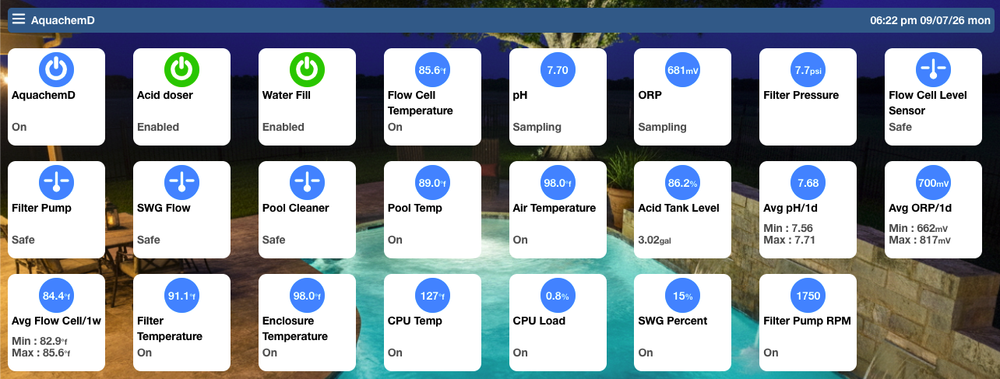
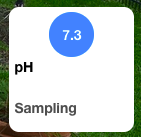
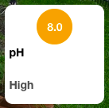
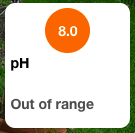
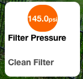
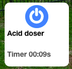
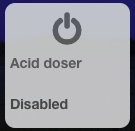
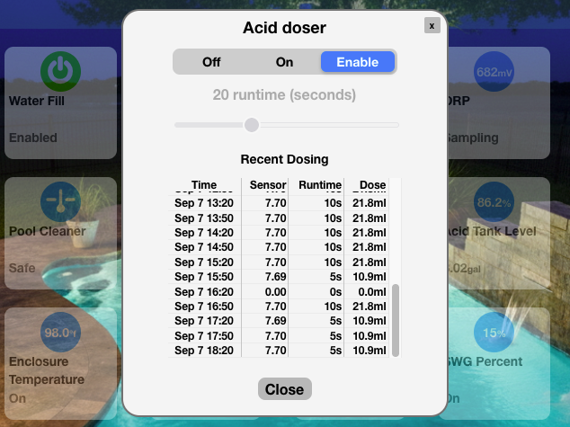

<p align="center">
  
</p>

<h1 align="center">AquachemD</h1>
<p align="center"><b>Open-source, automated pool water chemistry — pH, ORP, and dosing, done right.</b></p>

---

Pool chemistry controllers from the major manufacturers are closed, expensive, and locked to their own ecosystem. **AquachemD** is the alternative: a lightweight Linux daemon that runs on a Raspberry Pi, reads real pH/ORP/temperature/pressure sensors, drives your dosing pumps with the same logic a commercial controller uses, and hands everything over to MQTT so it plugs straight into Home Assistant, Apple HomeKit, or any automation stack you already run.

No subscriptions. No cloud dependency. No proprietary sensor lock-in. Just an open daemon, a config file, and full visibility into exactly what your pool chemistry is doing and why.

## Links to further details

- [Dosing strategy — the reasoning and real-world tuning behind the dosing approach](/docs/dosing%20strategy.md)
- [Hardware — supported sensors and hardware](/docs/hardware.md)
- [Flow-cell design — Evaluates physical flow-cell design(s), DIY and pre-made](/docs/flow%20cell%20design.md)
- [API — HTTP/MQTT integration](/docs/API.md)
- [Getting started](/docs/getting%20started.md)
- [Web UI / Homekit & HomeAssistant UI examples](/docs/UI.md)

## Quick Web UI overview

Full details on Interfaces (Web/App UI, HomeKit & HomeAssistant) are in [`Web UI.md`](/docs/UI.md)
Web interface and mobile app interface are identical, phone / app layout will simply use different number or rows and columns, [`Web UI.md`](/docs/UI.md) has examples.

<br><br>
<!--
- Each tile can have it's own limits for normal/high/out or range, and also custom text & colors for each, and will show timers / dose time / status etc

<table align="center" border="0" cellpadding="0" cellspacing="0">
  <tr>
    <td></td>
    <td></td>
    <td></td>
    <td></td>
    <td></td>
    <td></td>
  </tr>
</table>
<br><br>

- Dosers will show multiple options along with recent history


-->


## Why AquachemD

- **You own the data and the logic.** Everything runs locally on your own hardware. No cloud account, no vendor API, nothing to stop working if a company goes out of business.
- **It talks to what you already have.** MQTT with Home Assistant auto-discovery out of the box, a built-in web dashboard, and — if you're running [AqualinkD](https://github.com/aqualinkd/aqualinkd) for pool automation — dosing that's automatically synchronized with your filter pump schedule.
- **It's built for real pool hardware**, not a hobbyist proof of concept: industrial Atlas Scientific EZO sensor circuits, GPIO-driven relay pumps, and hardware/software safety interlocks that stop dosing the moment something looks wrong.
- **It's honest about safety.** Dosing acid and chlorine into water that isn't flowing is a genuine hazard — not just an inconvenience. AquachemD is built around interlocks first, dosing logic second.
- **A better dosing strategy**, [Real-world tuning notes](docs/dosing%20strategy.md) walk through how one setup landed on its numbers — including a comparison against how Pentair, Jandy & IPS controllers approach the same problem, and why a tuned table can outperform their generic formulas.

## What it actually does

### Reads your water chemistry
- **pH and ORP** via Atlas Scientific EZO circuits over I2C — the same industrial-grade sensors used in commercial pool controllers.
- **Temperature** via an EZO probe, a DS18B20 One-Wire sensor, or pulled in from an external MQTT source (e.g. your filter pump's built-in sensor).
- **Filter pressure** via an I2C pressure sensor, useful for catching a clogging filter before it becomes a flow problem.
- **Any other Linux sysfs value** through a generic, regex-based sensor reader — if it shows up as a file under `/sys`, AquachemD can read it and publish it.
- Optional **temperature-compensated pH readings**, since a probe's raw millivolt output drifts with water temperature.

Sensors can also be told to simply stop trusting their own readings when conditions aren't right. Each sensor can be scoped to a safety interlock (the same flow-cell-full / pump-running condition that gates dosing), so a pH or ORP probe sitting in stagnant or drained water doesn't feed a bogus reading into your dashboard or dosing logic. Sensors that don't depend on flow — filter pressure, or a value pulled in from an external MQTT source — can be exempted from that gating and keep reporting regardless.

### Doses automatically, and tells you exactly why
AquachemD uses a **threshold table**, not a black box: you define pH/ORP ranges and how long to run the pump for each one (e.g. "if pH is 8.0 or above, dose for 20 seconds"), and the daemon works out which bracket the current reading falls into. Two additional refinements that go beyond a simple lookup table:
- **Average-dose calculation** — smooths dosing decisions using a rolling average instead of reacting to a single noisy reading.
- **Per-channel maximum dose time** — a hard ceiling on how long any single dose can run, independent of what the threshold table says, so a bad sensor reading can never trigger a runaway dose.

A separate **water-topup doser** (`h2o`) is supported alongside pH and ORP dosing, for automated fill in response to level sensors.

**Dosing checks run on a full cron schedule** — not a fixed interval — so you have complete control over cadence. Check and dose every 30 minutes through summer, drop to every 2 hours over winter, or run a different schedule on weekends; it's standard cron syntax (minute/hour/day/month/weekday), editable straight from the web UI.

Each dosing channel can also independently choose whether to react to the **live sensor reading or a rolling average**, on a user-defined reset period. This matters because pH and ORP don't behave the same way: pH is comparatively stable, so dosing off the live reading gives the fastest correction, while ORP can swing significantly over the course of a day — dosing straight off a live ORP spike risks over-correcting, so averaging it over a period (e.g. hourly or daily) gives a steadier basis for the dose calculation. Both channels support either mode; which one suits your pool is your call.

As a backstop against a sensor going haywire, each doser also has a **user-set maximum total volume per period** (e.g. 500 mL a day). If that cap is hit, AquachemD logs a warning and simply skips further dosing on that channel until the period resets — it doesn't disable the doser or require you to intervene, since the cap is there to survive a temporarily bad reading, not to demand a manual reset every time it's touched.

Curious how to actually tune this for your own pool? [Real-world tuning notes](docs/dosing%20strategy.md) walk through how one setup landed on its numbers — including a comparison against how Pentair and IPS controllers approach the same problem, and why a tuned table can outperform their generic formulas.

### Won't dose unless it's actually safe to
This is the part that matters most. Dosing is gated behind **interlock conditions** that must *all* be satisfied before a pump is allowed to run:
- **MQTT interlocks** — e.g. only dose if AqualinkD reports the filter pump is running. This is how AquachemD and AqualinkD stay in sync without any direct wiring between them.
- **GPIO interlocks** — physical flow switches or tank-level sensors wired directly to the Pi, with a configurable delay before a condition is considered "met" (avoiding false triggers from momentary flow blips).

The result: chemicals are never dispensed into stagnant water, which is exactly the scenario that risks dangerous gas buildup from mixing chlorine and acid.

Interlocks aren't limited to "is the filter pump on" — any equipment state you can get onto MQTT can gate a doser. A common example: if your acid injection point sits physically upstream of a pressure-side pool cleaner, dosing while that cleaner's booster pump is running can alter flow through the injection point in ways that make dosing unpredictable. Point an MQTT interlock at the booster pump's running state, and AquachemD simply won't dose while it's active — no different in principle from the filter-pump interlock, just watching a different piece of equipment.

Conditions can also delay how long *sensors* are trusted after they're satisfied, not just how long dosers wait — useful for exactly the situation you'd expect: if your filter pump has been off overnight, the water sitting in the flow cell and pipework is stagnant and gives misleading pH/ORP readings the instant the pump kicks back on. Setting a delay (e.g. 60 seconds) on the filter-pump condition means AquachemD waits for genuinely fresh, circulating pool water before trusting those readings again, rather than reacting to a stale first reading.

Interlocks aren't just limited to pool equipment, extreme example. You can limit acid dosing if people are detected in the pool. Implementation :- Camera pointed at the pool, when it detects people post MQTT message, have AquachemD interlock set to that message. This is very simply to implement and has been tested with UniFi protect (video), HomeAssistant (post MQTT message from video), AquachemD read message as interlock.

### Not just dosing — plain GPIO switches too
Not every relay near your pool is a chemical doser. AquachemD also supports plain **GPIO switches** for anything else you want on/off control and HomeKit/Home Assistant visibility for — a booster pump, an auxiliary light, whatever's wired to a spare relay — using the same interlock and scope system as everything else, without forcing it to pretend to be a doser.

### Gives you a real dashboard, not just a config file
The built-in web UI (served directly by the daemon — no separate web server needed) shows live sensor readings and pump status over a websocket, lets you trigger a manual dose or override a pump directly, and includes an editable configuration screen for every setting described in this README. AquachemD can also self-upgrade to the latest release directly from the web UI.

## Publishes everything to MQTT, with Home Assistant discovery built in

Many other home Automation hubs now support HA MQTT Discovery protocol, ( Domoticz, Homey, openHAB, Hubitat etc), so this should also work for those hubs.

Every sensor reading, pump state, and dose event is published to MQTT with native **Home Assistant MQTT Discovery** — plug in your broker details and AquachemD's entities appear in Home Assistant automatically:
- Live pH, ORP, temperature, and pressure sensors, with long-term statistics for graphing.
- Dose-volume tracking (mL of acid/chlorine dispensed per day), using `total_increasing` state classes so Home Assistant's energy-dashboard-style tracking works out of the box.
- Binary "OK/Problem" entities for every safety interlock.
- Mode selectors (Off / On / Auto) for each doser.
- **Dose tank levels**, tracked as remaining volume (mL or gallons) and percentage, updated automatically as each dose is drawn from the tank and persisted across restarts. If you also set a minimum "consider empty" volume, the doser is automatically switched to **Off** once the tank hits it — not a transient auto-disable that clears itself the next cycle, but a persistent state that only clears once you update the tank's level again (after refilling it), so it never sits there silently trying to dose from a dry tank until you notice. Tank tracking works fine without the minimum-volume setting too — you just get level reporting without the auto-shutoff. Tank level is also published live to MQTT, so Home Assistant (or any automation you write) can warn you well before it gets to that point.

## HomeKit integration

There are two supported ways to get AquachemD into Apple's Home app, depending on what you're already running.

### Option 1 — [homebridge-aquadaemon](https://github.com/aqualinkd/homebridge-aquadaemon) (recommended)
The companion Homebridge plugin talks to AquachemD directly over MQTT — no Home Assistant required. It maps devices to the *correct* native HomeKit types rather than working around HomeKit's limitations: dosers appear as HomeKit Valves (with a real countdown timer) or Switches, pH/ORP/PPM readings display as Light Sensor values, and tank levels can show as remaining gal/mL instead of a bare percentage. This is the most direct path if Homebridge is your smart-home hub.

### Option 2 — Home Assistant's native HomeKit Bridge
If you're already running Home Assistant for other integrations, its built-in HomeKit bridge can expose AquachemD's auto-discovered entities to Apple Home too. Because HomeKit has no native concept of "pH sensor" or "ORP sensor," this path relies on creative re-mapping — for example, showing pH as a Humidity Sensor tile so the numeric value is visible at a glance, or an out-of-range chemistry alert as an Occupancy Sensor so it surfaces as an iOS notification. It works well once configured, but the entity types you see in the Home app won't always match what they represent. Full mapping guidance is in [`homekit entity.md`](/docs/homekit%20entity.md).

## Custom Integrations

AquachemD can easily be integrated into ano other home automation hub using MQTT or HTTP [`API.md`](/docs/API.md) has complete details of API interfaces.

## Hardware

AquachemD is built to run on a **Raspberry Pi** (official release binaries are cross-compiled for both `armhf` — Pi 1 through 4, 32-bit — and `arm64` — Pi 3/4/Zero 2 W and newer, 64-bit), using:
- **I2C** for Atlas Scientific EZO sensor circuits and the optional pressure sensor.
- **GPIO**, via `libgpiod`/`/dev/gpiochip0`, for relay-driven dosing pumps and physical interlock switches.
- **1-Wire** for DS18B20 temperature probes, if you're not using an EZO temperature circuit.

More information is in [`hardware.md`](/docs/hardware.md).
If you're building or adapting the physical sensor housing, [`flow cell design.md`](/docs/flow%20cell%20design.md) documents a tested, low-turbulence PVC flow cell design (with a full parts rationale) for mounting pH, ORP, and temperature probes safely outside the main plumbing run.

## Installation

The release install script handles the whole setup — downloading the correct architecture's binary, installing it as a systemd service, and setting up the web UI:

```bash
curl -sSL https://raw.githubusercontent.com/aqualinkd/AquachemD/main/release/remote-install.sh | bash
```

This installs AquachemD as a systemd service (`aquachemd.service`) that starts on boot, alongside a starter config at `/etc/aquachemd.conf` (or wherever your install script places it) that you'll edit to match your actual sensor addresses and pump wiring.

See [`getting started.md`](/docs/getting%20started.md) for more information

### Building from source
If you want to build it yourself rather than use a release binary, a `Makefile` supports both native and cross-architecture builds:
```bash
make            # build for the current architecture
make armhf      # cross-compile for 32-bit ARM (Pi 1-4)
make arm64      # cross-compile for 64-bit ARM (Pi 3/4/Zero 2W+)
make dummy      # build with simulated sensors, for testing without real hardware
```
A Docker-based cross-compilation environment (`docker/Dockerfile.releaseBinaries`) is also provided for producing both architectures' release binaries in one pass, which is how the official releases are built.

## Configuration

Everything is controlled through a single config file (default `/etc/aquachemd.conf`, or editable live from the web UI). A minimal working example:

```ini
listen_address=http://0.0.0.0:88
log_level=notice

mqtt_server=mqtt://homeassistant:1883
mqtt_aquachemd_topic=aquachemd
mqtt_aqualinkd_topic=aqualinkd
mqtt_discovery_use_mac=YES

gpio_chip=/dev/gpiochip0
sensor_poll_time=10
temp_compensated_ph=yes

temp_sensor_label=Flow Cell Temperature
temp_sensor_type=ezo
temp_sensor_address=0x68

ph_sensor_label=pH
ph_sensor_type=ezo
ph_sensor_address=0x63

orp_sensor_label=ORP
orp_sensor_type=ezo
orp_sensor_address=0x64

gpio_doser_label=Acid doser
gpio_doser_type=pH
gpio_doser_pin=19
gpio_doser_pin_mode=Active High
gpio_doser_interlock_scope=Global
gpio_doser_ml_per_second=2.18
```


## Full configuration reference

#### System & web
| Option | Description |
| :--- | :--- |
| `main_label` | Display name for the primary sampling/control group. |
| `listen_address` | IP and port for the built-in web server. |
| `log_level` | `DEBUG`, `INFO`, `NOTICE`, `WARNING`, `ERROR` |
| `sensor_poll_time` | How often (seconds) sensors are polled. |
| `log_sensor_readings` | Log every sensor reading, not just changes. |
| `master_off_as_interlock_global` | When you turn off Master, turn everything off or just global interlock. see Safety interlocks below |

#### MQTT & Home Assistant
| Option | Description |
| :--- | :--- |
| `mqtt_server` | Broker URI, e.g. `mqtt://homeassistant:1883`. |
| `mqtt_user` / `mqtt_passwd` | Broker credentials. |
| `mqtt_aquachemd_topic` | Root topic this instance publishes under. |
| `mqtt_aqualinkd_topic` | Root topic to listen for AqualinkD state on (for pump interlocks). |
| `mqtt_discovery_topic` | Home Assistant discovery prefix (default `homeassistant`). |
| `mqtt_discovery_use_mac` | Append the device MAC to discovery IDs. |
| `mqtt_timed_update` | Force a periodic MQTT update even if a value hasn't changed. |
| `mqtt_convert_to_degF` | Publish temperature in °F instead of °C. |

#### Dosing
| Option | Description |
| :--- | :--- |
| `ph_dose_range` / `orp_dose_range` | Threshold table, e.g. `8.0:20` = if pH ≥ 8.0, dose for 20s. |
| `ph_default_dose_time` / `orp_default_dose_time` | Fallback dose time if no threshold matches. |
| `ph_max_dose_time` / `orp_max_dose_time` | Hard ceiling on a single dose, regardless of threshold. |
| `ph_average_dose_calc` / `orp_average_dose_calc` | Use a rolling average of readings rather than the latest single reading. |
| `h2o_default_dose_time` / `h2o_max_dose_time` | Same pattern, for the water-topup doser. |
| `temp_compensated_ph` | Adjust pH readings for current water temperature. |
| `gpio_doser_running_dose_max_ml` | Per-doser cap on total volume dosed within the current period. If hit, dosing is skipped (with a warning) until the total resets — it does not disable the doser. |
| `gpio_doser_tank_total_volume` / `gpio_doser_tank_uom` | Total capacity of the tank feeding this doser, and its unit (gal/mL) — enables tank-level tracking and reporting. |
| `gpio_doser_tank_min_volume` | Volume below which the tank is considered empty. If set (alongside `tank_total_volume`), the doser is forced Off once reached — see [Doses automatically](#doses-automatically-and-tells-you-exactly-why) above. Leave unset to track level without auto-shutoff. |

#### Safety interlocks
| Option | Description |
| :--- | :--- |
| `*_condition_severity` | (e.g. `mqtt_condition_severity`, `gpio_condition_severity`) How severe it is when this condition fails: `local` degrades the system to a soft limit (dosers pause, sensors keep reading); `global` degrades it to a hard interlock (dosers pause AND Global-scope sensors also stop). |
| `*_sensor_interlock_scope` | (including `gpio_input_interlock_scope`) How exposed this sensor is to interlocks raised elsewhere: `local` always read, regardless of severity — use for anything you always want visible, even through a hard interlock. `global` reads through a soft interlock but stops at a hard one. |
| `gpio_doser_interlock_scope` | How exposed this doser is to interlocks raised elsewhere: `local` only stops for a hard interlock, keeps dosing through a soft one. `global` stops for either. There is no `allow` for a doser — it must always respect at least a hard interlock. |
| `gpio_output_interlock_scope` | How exposed this switch is to interlocks raised elsewhere: `local` only stops for a hard interlock, keeps running through a soft one. `global` stops for either. `allow` always ignores interlock state. |

## Complete details of all inputs / outputs

| Option | Description |
| --- | --- |
| `mqtt_condition_label` | Label to identify the MQTT condition block |
| `mqtt_condition_topic` | MQTT topic path to monitor for condition state |
| `mqtt_condition_value` | Expected string/int value required to satisfy the condition |
| `mqtt_condition_severity` | Severity failed condition that defines interlock scope for sensors (e.g., `global` vs `local`) |
| `mqtt_condition_met_delay` | Delay duration (in seconds) before marking condition as met |
| --- | --- |
| `gpio_condition_label` | Label to identify the GPIO condition block |
| `gpio_condition_pin` | Target GPIO pin number to sample |
| `gpio_condition_pin_mode` | Pin configuration mode (`Active High` / `Active Low`) |
| `gpio_condition_required_state` | Boolean pin state required to satisfy condition (`0`/`1`) |
| `gpio_condition_severity` | Severity failed condition that defines interlock scope for sensors (e.g., `global` vs `local`) |
| `gpio_condition_met_delay` | Delay duration (in seconds) before marking condition as met |
| --- | --- |
| `ph_sensor_label` | Label to identify the pH sensor block |
| `ph_sensor_type` | Driver or hardware sub-type (e.g., `ezo`) |
| `ph_sensor_address` | Hexadecimal I2C bus address for the sensor |
| `ph_sensor_interlock_scope` | Interlock scope for sensor execution control |
| `ph_sensor_statistics` | Configuration parameters for sensor statistics tracking (eg, 1 day, 1 week, 2 hours) <b>**See note</b>|
| --- | --- |
| `orp_sensor_label` | Label to identify the ORP sensor block |
| `orp_sensor_type` | Driver or hardware sub-type (e.g., `ezo`) |
| `orp_sensor_address` | Hexadecimal I2C bus address for the sensor |
| `orp_sensor_interlock_scope` | Interlock scope for sensor execution control |
| `orp_sensor_statistics` | Configuration parameters for sensor statistics tracking (eg, 1 day, 1 week, 2 hours)  <b>**See note</b>|
| --- | --- |
| `prs_sensor_label` | Label to identify the pressure sensor block |
| `prs_sensor_type` | Driver or hardware sub-type (e.g., `ezo`, `pte7300`) |
| `prs_sensor_address` | Hexadecimal I2C bus address for the sensor |
| `prs_sensor_interlock_scope` | Interlock scope for sensor execution control |
| `prs_sensor_statistics` | Configuration parameters for sensor statistics tracking (eg, 1 day, 1 week, 2 hours)  <b>**See note</b>|
| `prs_sensor_min_value` | Minimum raw input value for I2C pressure conversion |
| `prs_sensor_max_value` | Maximum raw input value for I2C pressure conversion |
| --- | --- |
| `mqtt_sensor_label` | Label to identify the MQTT sensor block |
| `mqtt_sensor_topic` | MQTT topic path delivering numerical sensor values |
| `mqtt_sensor_uom` | Unit of measurement string displayed for readings |
| --- | --- |
| `temp_sensor_label` | Label to identify the temperature sensor block |
| `temp_sensor_type` | Driver or hardware sub-type (e.g., `ezo`, `d1w`, `mqtt`) |
| `temp_sensor_address` | Hexadecimal I2C bus address for the sensor |
| `temp_sensor_topic` | MQTT topic path (when using MQTT temperature sensor) |
| `temp_sensor_path` | Linux 1-Wire sysfs device path (when using 1-Wire temperature sensor) |
| `temp_sensor_offset` | Fixed offset value added to raw temperature readings |
| `temp_sensor_scale` | Scale multiplier applied to raw temperature readings |
| `temp_sensor_interlock_scope` | Interlock scope for sensor execution control |
| `temp_sensor_statistics` | Configuration parameters for sensor statistics tracking (eg, 1 day, 1 week, 2 hours)  <b>**See note</b> |
| `temp_sensor_uom` | Unit of measurement string (e.g., `°C`, `°F`) |
| --- | --- |
| `gpio_doser_label` | Label to identify the GPIO doser block |
| `gpio_doser_type` | Controller or hardware driver type for the dosing pump |
| `gpio_doser_pin` | Target GPIO pin controlling the dosing pump relay |
| `gpio_doser_address` | Hexadecimal address (if using I2C relay expansion) |
| `gpio_doser_pin_mode` | Pin configuration mode for the doser output pin |
| `gpio_doser_ml_per_second` | Dosing pump flow rate calibration value (mL per second) |
| `gpio_doser_tank_total_volume` | Total maximum liquid capacity of the associated chemical tank |
| `gpio_doser_tank_min_volume` | Minimum safe liquid threshold before dosing disabled |
| `gpio_doser_tank_uom` | Unit of measurement string for tank capacity (e.g., `Gallons`, `Litres`) |
| `gpio_doser_running_dose_max_ml` | Maximum volume allowed during a pre defined period (usually 1day) <b>**See note</b> |
| `gpio_doser_interlock_scope` | Interlock scope for doser safety overrides |
| --- | --- |
| `gpio_input_label` | Label to identify the general GPIO input block |
| `gpio_input_pin` | Target GPIO pin number to sample |
| `gpio_input_pin_mode` | Pin configuration mode (`Active High` / `Active Low`) |
| `gpio_input_required_state` | Logical pin state required for active status |
| --- | --- |
| `gpio_output_label` | Label to identify the general GPIO output block |
| `gpio_output_pin` | Target GPIO pin number to drive |
| `gpio_output_pin_mode` | Pin output drive mode |
| `gpio_output_interlock_scope` | Interlock scope for output execution boundaries |
| --- | --- |
| `sysfs_sensor_label` | Label to identify the SysFS sensor block |
| `sysfs_sensor_path` | Absolute Linux filesystem path to sysfs attribute file |
| `sysfs_sensor_offset` | Fixed offset added to raw sysfs reading |
| `sysfs_sensor_scale` | Scale multiplier applied to raw sysfs reading |
| `sysfs_sensor_regex` | Regex pattern used to extract numerical value from sysfs text |
| `sysfs_sensor_uom` | Unit of measurement string displayed for readings |


<b>**note</b> These options are totally dependant on when you want to reset them, please use the AquachemD scheduler to schedule the reset at the time of day/week/month you prefer.

## Related projects

- [**AqualinkD**](https://github.com/aqualinkd/aqualinkd) — pool equipment automation (pumps, heaters, lights) for Jandy/AquaLink controllers. AquachemD's MQTT interlocks are designed to sync directly with it.
- [**homebridge-aquadaemon**](https://github.com/aqualinkd/homebridge-aquadaemon) — the Homebridge plugin bringing both AqualinkD and AquachemD into Apple HomeKit.

## Support

Found a bug, or something not covered here? Please open a [GitHub issue](https://github.com/aqualinkd/AquachemD/issues) — include your `log_level=debug` output and relevant config lines where possible.


