

  

<h1 align="center">AquachemD</h1>

<b>Open-source, automated pool water chemistry — pH, ORP, and dosing, done right.</b>

---

[Web / App UI examples](#WebUI)

[Homekit examples](#HomeKit)

[HomeAssistant examples](#HomeAssistant)

---

# Quick Web UI overview

Full details on all UI options coming soon, below are a few examples. Just about everything is fully customizable.

  

- Each tile can have it's own limits for normal/high/out or range, and also custom text & colors for each, and will show timers / dose time / status etc

<table align="center" border="0" cellpadding="0" cellspacing="0">
  <tr>
    <td></td>
    <td></td>
    <td></td>
    <td></td>
    <td></td>
    <td></td>
  </tr>
</table>
  

- iPhone app is same interface
<table align="center" border="0" cellpadding="0" cellspacing="0">
  <tr>
    <td>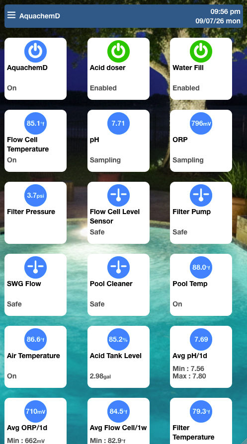</td>
  </tr>
</table>
  

- Dosers will show multiple options along with recent history
<table align="center" border="0" cellpadding="0" cellspacing="0">
  <tr>
    <td></td>
  </tr>
</table>
  

- AquachemD Managment Console. (click the burger icon top left of screen)

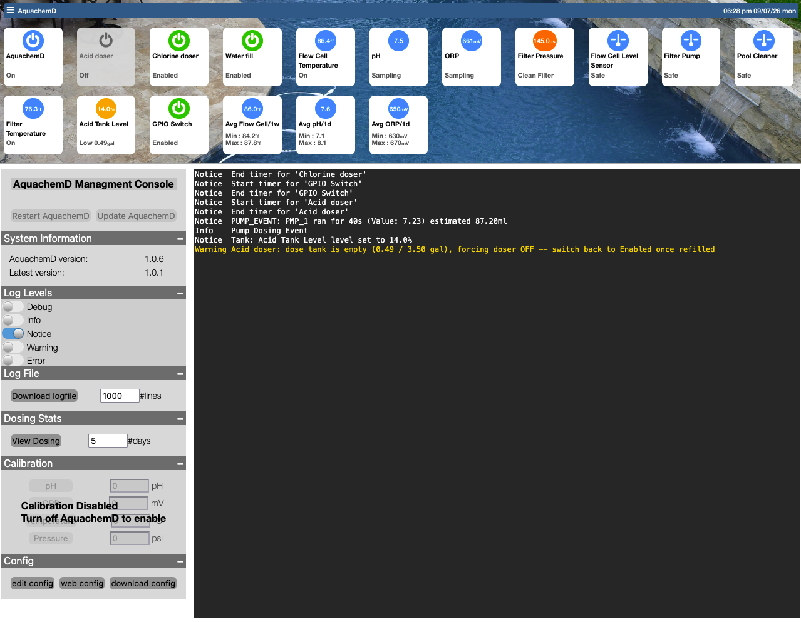
  

- AquachemD Scheduler.  Interface for cron. (click the date in top right of screen)

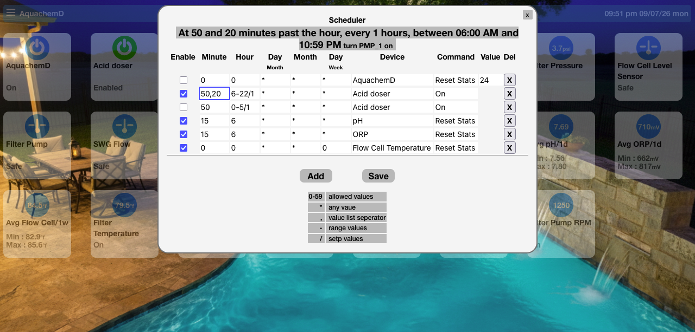
  

- Few examples, showing different limits.

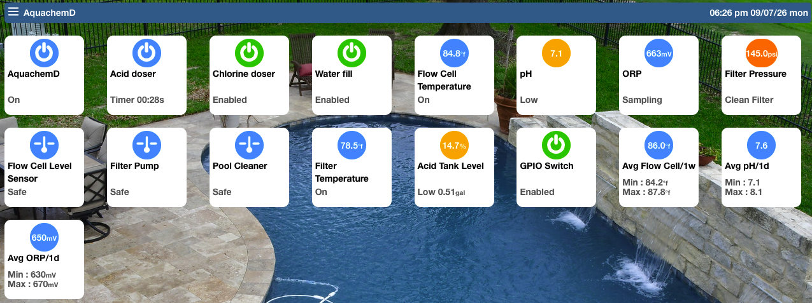
  
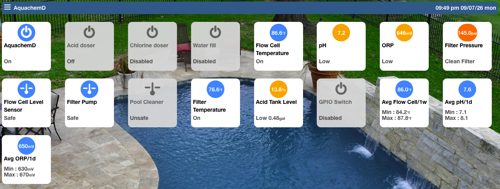

----

# Quick HomeKit overview

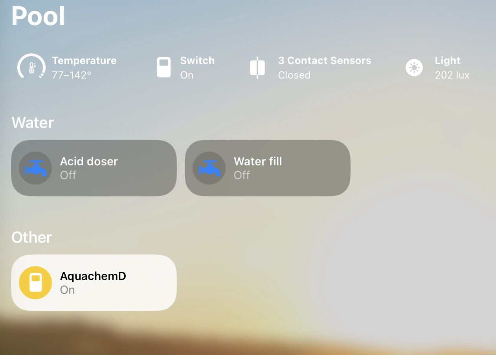
  

  
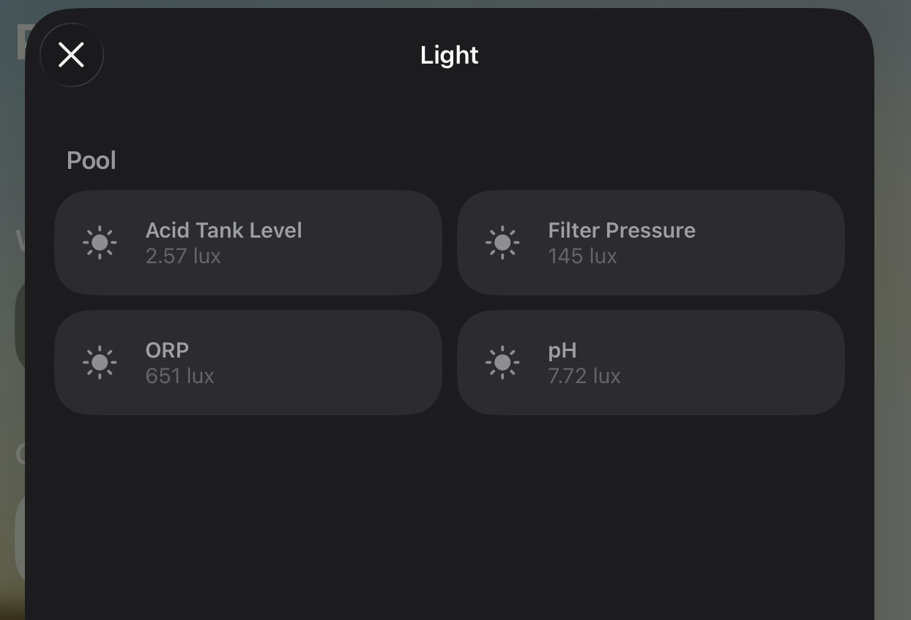
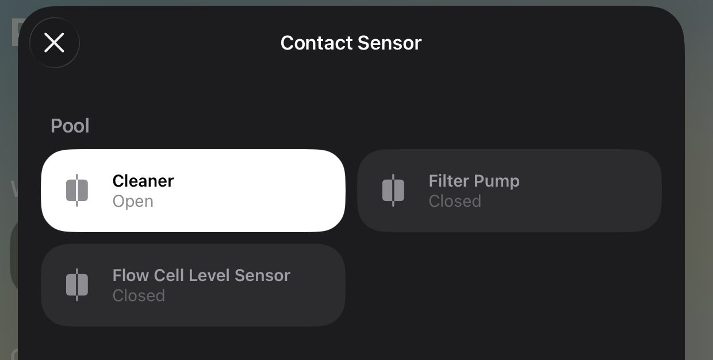
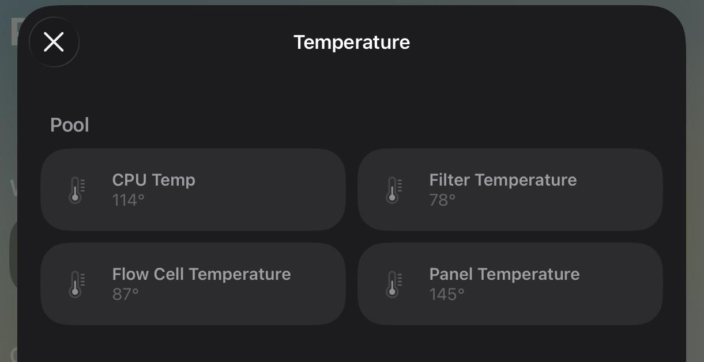

----

# Quick HomeAssistant examples

These are simply the default templates, obviously you can fully customize to how you prefer.

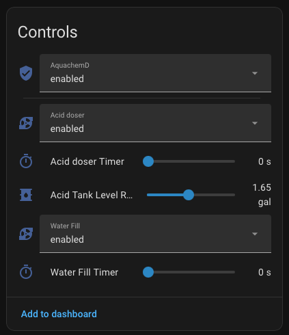
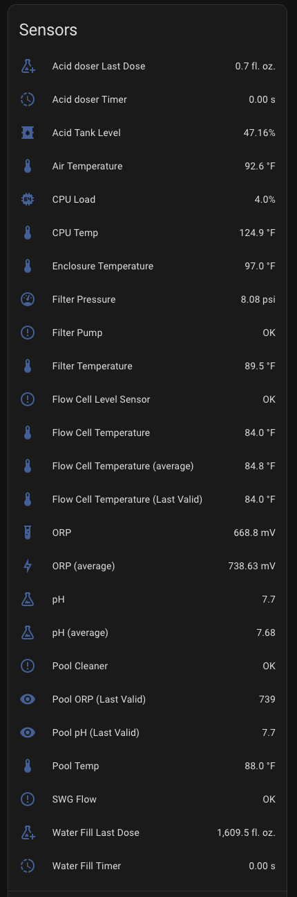

----

## Below is an example using Sensor Readings / Manual readings & Pool Maths (calculations)
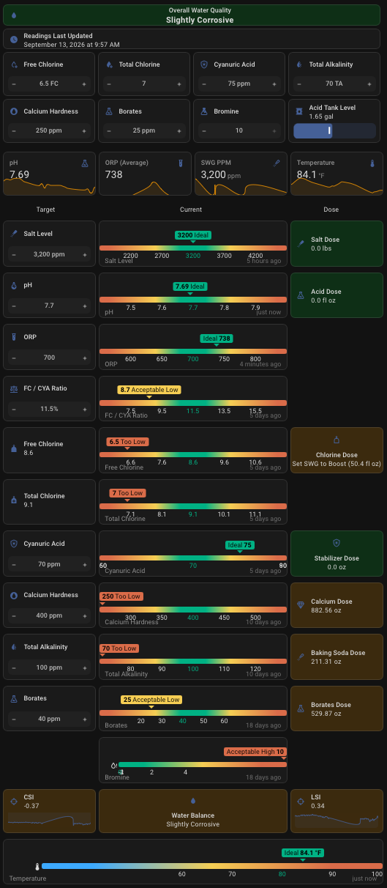