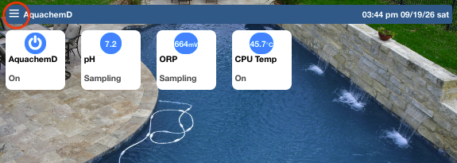
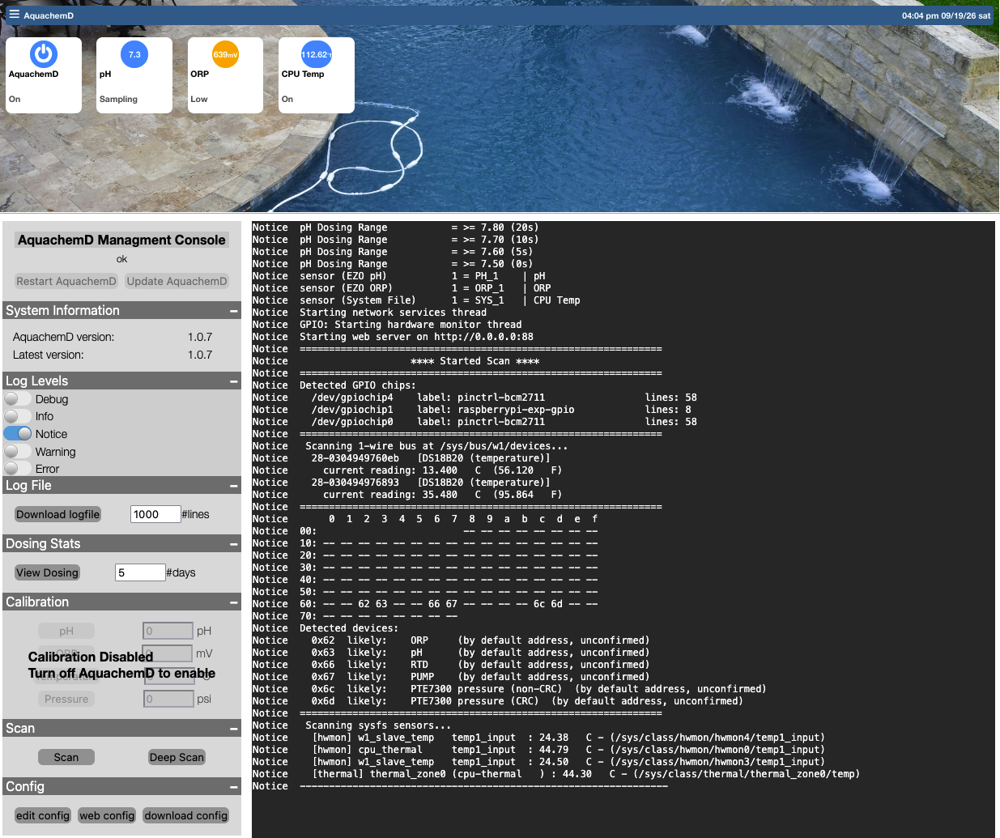

<p align="center">
  
</p>
<h1 align="center">AquachemD</h1>
<p align="center"><b>Open-source, automated pool water chemistry — pH, ORP, and dosing, done right.</b></p>
<hr>
<br>
<br>

# Installation

The release install script handles the whole setup — downloading the correct architecture's binary, installing it as a systemd service, and setting up the web UI:

```bash
curl -sSL https://raw.githubusercontent.com/aqualinkd/AquachemD/main/release/remote-install.sh | bash
```

## Few pre-requisites.
- Raspberry Pi OS based on Debian 13 (Trixie) or newer.
- more than lightly need to enable i2c
    - Make sure `dtparam=i2c_arm=on` is in `/boot/firmware/config.txt`
    - Or use `sudo raspi-config`
- maybe enable 1 wire if using D1W sensors (like )
    - Make sure `dtoverlay=w1-gpio` is in `/boot/firmware/config.txt`
    - Or use `sudo raspi-config`

Make sure to reboot after any changes. 

### configuration.

At this point aquachemd should be up and running on port 80.  So use a web browser to go to `http://ip.of.machine/` and you should see a basic page (below).   Hit the "burger" icon (3 lines) at top left of screen to load the managment page.




In this page you will want to setup all your devices. But first thing is to probably scan your system and see what AqualinkD can see, so simply press the `Scan` button (left).
Then you can start adding devices, hit the `edit config` button to bring up the config editor, and you can start adding all your sensors / interlocks etc.  For details of what each config entry is, please see [configuration reference](https://github.com/aqualinkd/AquachemD/tree/main#full-configuration-reference).

# Errors
AquachemD uses systemd for a startup, you can look at error / start / stop using one of the below commands.
```
sudo systemctl status aqualinkd
sudo systemctl stop aqualinkd
sudo systemctl start aqualinkd
```

You can manually edit the config file `/etc/aquachemd.conf` using your favorite editor.

You can run AquachemD manually with, (to see any errors)
```
sudo /usr/local/bin/aquachemd -c /etc/aquachemd.conf
```

Command line options are
```
        -h         (help message)
        ---- Normal Runmode ----
        -c <file>  (Configuration file)
        -v         (Debug logging)
        ---- Scan mode ----
        scan       (Scan system for devices & chips)
        deepscan   (Scan system for devices & chips & scan GPIO chips in detail)
        ---- Calibration mode ----
        calibrate  (calibrate help)
        calibrate ph  <low|mid|high>
        calibrate orp <mv_value>
        calibrate rtd <°C_value>
        calibrate prs <psi_value>
```


