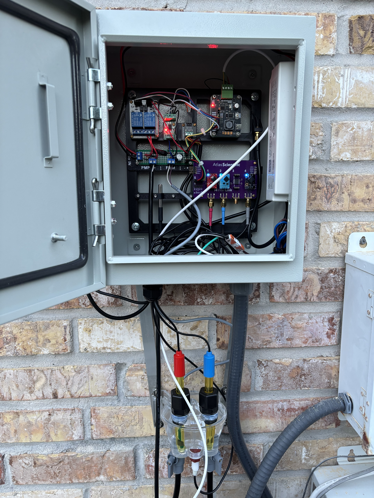

  

<h1 align="center">AquachemD</h1>

<b>Open-source, automated pool water chemistry — pH, ORP, and dosing, done right.</b>

---

### AquachemD currently supports the current hardware.  
If you want something not listed supported, please use the [Discussions forum](https://github.com/aqualinkd/AquachemD/discussions)

pH ORP sensors
- Atlas Scientific (All versions supported).
  - Uses EZO I2C interface, not EZO Serial Interface not supported.
- Most pH or ORP sensors can be connected to the Atlas Scientific EZO boards.

Dosing
- Atlas Scientific Pumps have been coded but not tested (not really compatible with pools)
- Any Dosing pump using a relay connected to GPIO.  (ie Pentair / Stenner etc )

Temperature sensors
- Atlas Scientific (All versions supported over EZO I2C interface)
- Any Dallas 1 Wire (ie DS18B20)
- Can also use existing control panel sensors (See MQTT below)

Pressure sensors
- Atlas Scientific (All versions supported over EZO I2C interface)
- Sensata PTE7300 Series - Built in driver over I2C
  - Cheaper that Atlas Scientific and have better resolution to a pool filter than Atlas Scientific due to lower BAR rating 
- Honeywell HSC/SSC - Build in driver over I2C (not fully tested)
- Any generic pressure sensor with ADC1115 interface board (using sysfs driver)

Float level / Flow sensor(s)
- Any generic sensor that's normally open or normally closed is supported.

General GPIO
- Supports ANY GPIO input or output.

MQTT - Any sensor from your current pool panel you can make available can be pulled into AquachemD.
- With AqualinkD that's every sensor, the most common are 
  - Filter Pump, SWG Flow Switch, Water Temp
  - SWG%, Pump RPM, SWG Error Code,
- If you have your panel connected to HomeAssistant, again every sensor should be able to be made available.
  - There are multiple ways to do this, simply search `homeassistant posting a sensor value to MQTT` in your favorite search engine
- Other home automation systems please see their specific pages.
 

-----------

### Other Pool Hardware.
You will need a way to mount your pH / ORP / water temp sensors.
[`flow cell design.md`](/docs/flow%20cell%20design.md) has details on that.

What I picked.

- IPS FC100G Flow cell.
    - Very smart design with build in level censor. Always keeps probes submerged even when no flow.
    - Did remove the drain valve and replace with Thermowell and temp sensor. (not recommended if you close pool or see freezing temps)
- Pentair Acid tank with Pump.
    - Simplicity, has a quality tank & pump build in, simply supply it power when you want it to dose.
- Atlas Scientific pH ORP Probes
- Atlas Scientific EZO Temp Sensor 
    - Waste of money, use D1W or Generic PT-1000 probe, or even temp from pool controller. 
    - The micro versions are also appallingly designed.
    - Originally wanted very accurate water temp for pH correction, after writing the software I realized that even 2 deg (over under reading) will not make any noticeable chang to the pH reading. Your water temp doesn't need to be that accurate.
- Atlas Scientific i4 interlink board.
    - Simply 1 board to mount all the EZO circuits on vs 2 or 3 separate boards, nice design and if you price everything separately from Atlas (ie not using kits), works out the same $$$.
- Sensata PTE7300 pressure sensor. 
    - Has I2C interface, AquachemD has designed a driver specifically for this sensor. Cheaper than Atlas Scientific and better resolution for pool filter (10bar version). Does also have a built in temperature sensor, but that's for reading internal sensor temp NOT the temp of the water hitting the pressure part of the sensor.

Ontop of the main components.

- Generic GPIO relay board.
    - The PSU for the Dosing pump (built into the acid tank) is turned on/off by this relay, and AquachemD controls the relay through GPIO on the Pi.
- Generic Optocoupler Isolation Module. 
    - To isolate computer power from anything close to water. Feed the flow cell float level wires to this module, and the other side to GPIO of Pi. This way you are not having 3.3v ot 5v powering your computer close to the water.
- PSU for Acid Pump.
- IPS Filter/Strainer for Flow Cell.  
    - Quickly realized that small particles that can bypass my sandfilter can cause the Flow Cell Level sensor to get stuck in the "on" position.

--------

### Bad picture in my install, will get better one.
 

